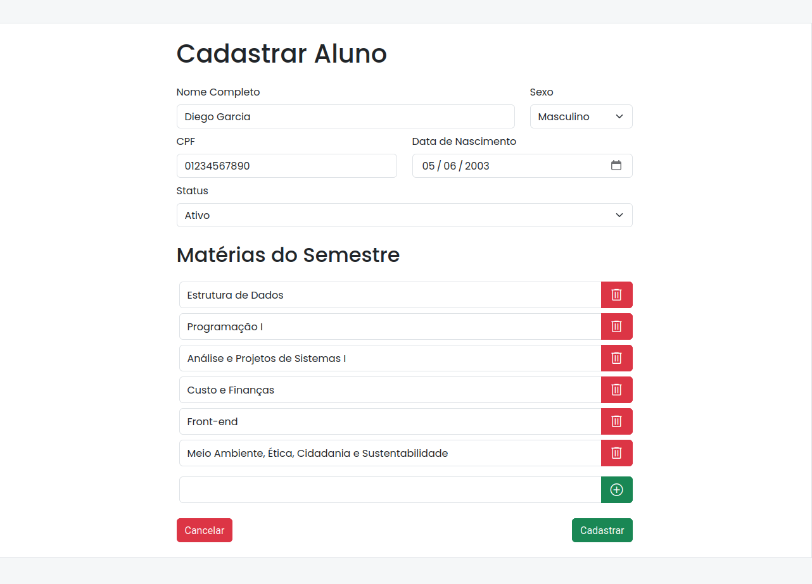

# cadastro-alunos

Formulário de cadastro de alunos desenvolvido visando aprender sobre Bootstrap

[Acessível no Github Pages](https://d1360-64rc14.github.io/cadastro-alunos/)

## Detalhes Técnicos

O envio do formulário é realizado pelo método POST com corpo em formato `application/x-www-form-urlencoded`.

Os valores enviados são:

- `name`: nome do aluno;
- `sex`: `male` ou `female`;
- `cpf`: CPF, apenas números;
- `status`: `active` ou `inactive`;
- `subjects`: uma única matéria, ou uma lista de matérias em caso de multiplas.